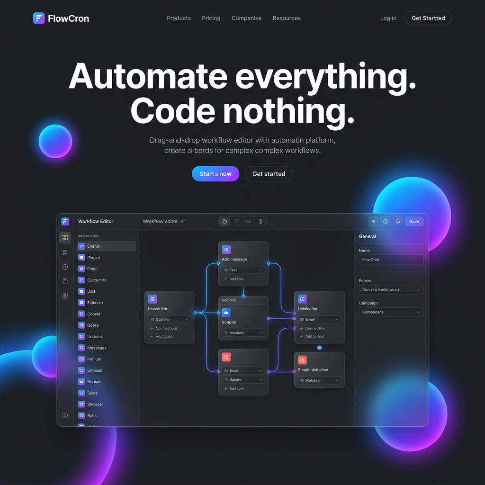

# FlowCron ⚡️

A production-ready, visual workflow automation platform with a stunning Apple Liquid Glass interface (iOS 26 / MacOS Tahoe inspired).



## 🌟 Features

- **Liquid Glass UI**: Every component features frosted glass effects, vibrant gradient orbs, and buttery-smooth animations.
- **Visual Workflow Editor**: Drag-and-drop node-based editor using `@xyflow/react`.
- **16 Internal Node Types**:
  - **Triggers**: Manual, Schedule (Cron), Webhooks.
  - **Actions**: HTTP Requests, Email (Resend), Slack, Discord, Database Storage.
  - **Logic**: If/Else, Switch, Delay, Loop, Transform, Filter, Code (JS).
- **Execution Engine**: Robust DAG traversal with variable interpolation (`{{node.output.field}}`).
- **Real-time Monitoring**: WebSocket-powered live execution logs and progress tracking.
- **Scheduling**: Built-in APScheduler for high-precision cron tasks.
- **Modern Tech Stack**: React 18, Vite, Tailwind CSS v4, Framer Motion, FastAPI, SQLAlchemy, SQLite/PostgreSQL.

## 🚀 Getting Started

### Prerequisites

- Node.js 18+
- Python 3.11+
- NPM / Pip

### Installation

1. **Clone the repository**:
   ```bash
   git clone https://github.com/yourusername/flowcron.git
   cd FlowCron
   ```

2. **Frontend Setup**:
   ```bash
   npm install
   npm run dev
   ```

3. **Backend Setup**:
   ```bash
   cd backend
   python -m venv venv
   source venv/bin/activate  # On Windows: venv\Scripts\activate
   pip install -r requirements.txt
   uvicorn app.main:app --reload
   ```

### Using the Platform

1. **Sign Up**: Create a new account with the glass-themed auth system.
2. **Create Workflow**: Use the "New Workflow" button on the dashboard.
3. **Design**: Drag nodes from the left palette (Manual Trigger is a good start).
4. **Connect**: Link nodes together to define your logic.
5. **Configure**: Click nodes to set their parameters (e.g., URL for HTTP Request).
6. **Save & Execute**: Click Save, then Execute to see your workflow in action!

## 🌗 Design Philosophy

FlowCron follows Apple's new **Liquid Glass** design language:
- **Pure Black Base**: Depth and contrast.
- **Floating Orbs**: 5 animated gradient blurred orbs that make the UI feel alive.
- **Glass Cards**: Heavily utilized `backdrop-filter: blur(20px)` and subtle borders.
- **Typography**: Apple's premium look with 'Inter' and SF Pro fallbacks.

## 🛠 Tech Stack

- **Frontend**: React, Vite, Tailwind CSS v4, Framer Motion, Zustand, React Flow, Axios.
- **Backend**: FastAPI, SQLAlchemy, Pydantic, APScheduler, python-jose.
- **Database**: SQLite (default for development), PostgreSQL-compatible via SQLAlchemy.

---

Built with ❤️ by Antigravity
